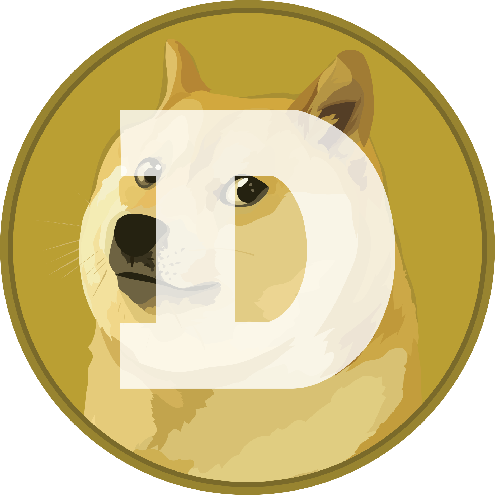

[![Contributors][contributors-shield]][contributors-url]
[![Forks][forks-shield]][forks-url]
[![Stargazers][stars-shield]][stars-url]
[![Issues][issues-shield]][issues-url]
[![MIT License][license-shield]][license-url]

<!-- PROJECT LOGO -->
 

    
    

  <h3 align="center">Shiba Inu</h3>

  

    
     
    Shiba Inu price on your wrist!
     
     
    ·
    <a href="https://github.com/Likenttt/Shiba-inu-price-garmin-widget/issues">Report Bug</a>
    ·
    <a href="https://github.com/Likenttt/Shiba-inu-price-garmin-widget/issues">Request Feature</a>
    ·
    <a href="https://apps.garmin.com/en-US/apps/c6168ee2-aa5b-42d3-964d-7a891fb8fc12">Connect IQ store</a>
  

<!-- TABLE OF CONTENTS -->

  
Table of Contents

  <ol>
    <li>
      <a href="#about-the-project">About The Project</a>
    </li>
    <li><a href="#roadmap">Roadmap</a></li>
    <li><a href="#contributing">Contributing</a></li>
    <li><a href="#projects">Widgets based on this project</a></li>
    <li><a href="#license">License</a></li>
    <li><a href="#contact">Contact</a></li>
    <li><a href="#reference">Reference</a></li>

  </ol>

<!-- ABOUT THE PROJECT -->
## About The Project

[![Demo][product-screenshot]](https://github.com/Likenttt/Shiba-inu-price-garmin-widget)

This is a widget for Garmin watch.

## Roadmap

See the [open issues](https://github.com/Likenttt/Shiba-inu-price-garmin-widget/issues) for a list of proposed features (and known issues).

<!-- CONTRIBUTING -->
## Contributing

Contributions are what make the open source community such an amazing place to be learn, inspire, and create. Any contributions you make are **greatly appreciated**. Besides, you are welcomed to make a widget for another encrypted currency with this project. Just fork and midify it, and remember to tell me the link~ I will add it to the list below.

## Projects

Here are projects base on this widgets. Thanks for your composition and share.

<!-- LICENSE -->
## License

Distributed under the MIT License. See `LICENSE` for more information.

<!-- CONTACT -->
## Contact

Chuanyi - [@KentLee](https://twitter.com/KentLee01607301) - chuanyi@88.com

Project Link: [Dogecoin](https://github.com/Likenttt/Shiba-inu-price-garmin-widget)

## Reference

[Price Sign](https://zh.wikipedia.org/zh-cn/%E8%B4%A7%E5%B8%81%E7%AC%A6%E5%8F%B7)

## Thanks

Thanks JetBrains for the free open source license

<!-- MARKDOWN LINKS & IMAGES -->
<!-- https://www.markdownguide.org/basic-syntax/#reference-style-links -->
[contributors-shield]: https://img.shields.io/github/contributors/Likenttt/Shiba-inu-price-garmin-widget.svg?style=for-the-badge
[contributors-url]: https://github.com/Likenttt/Shiba-inu-price-garmin-widget/graphs/contributors
[forks-shield]: https://img.shields.io/github/forks/Likenttt/Shiba-inu-price-garmin-widget.svg?style=for-the-badge
[forks-url]: https://github.com/Likenttt/Shiba-inu-price-garmin-widget/network/members
[stars-shield]: https://img.shields.io/github/stars/Likenttt/Shiba-inu-price-garmin-widget.svg?style=for-the-badge
[stars-url]: https://github.com/Likenttt/Shiba-inu-price-garmin-widget/stargazers
[issues-shield]: https://img.shields.io/github/issues/Likenttt/Shiba-inu-price-garmin-widget.svg?style=for-the-badge
[issues-url]: https://github.com/Likenttt/Shiba-inu-price-garmin-widget/issues
[license-shield]: https://img.shields.io/github/license/Likenttt/Shiba-inu-price-garmin-widget.svg?style=for-the-badge
[product-screenshot]: screenshot/dogecoin_break0_4_usd.png
